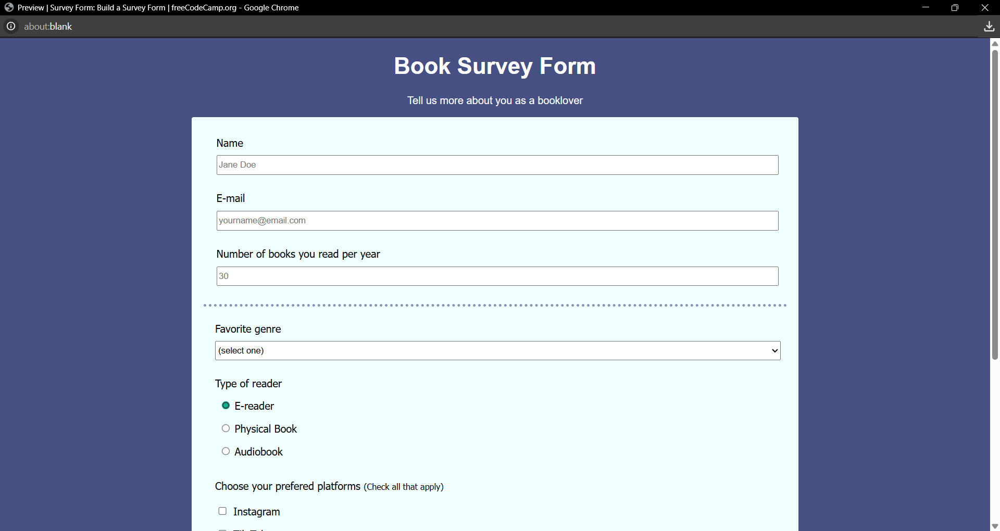

# Book Survey Form  

This project is part of the **Responsive Web Design Certification** from freeCodeCamp.  
It is a simple survey form designed for book lovers, where users can share their reading habits and preferences.  

## Features  
- Clean HTML form structure  
- CSS styling for layout and colors  
- Input fields (name, email, number)  
- Dropdown menu for selecting favorite genre  
- Radio buttons for reader type  
- Checkboxes for preferred platforms  

## Screenshot  
  

## Live Demo  
👉 [View on GitHub Pages](https://daniela-padilha.github.io/Book-Survey-Form/)  

## Tech Stack  
- HTML5  
- CSS3  

## How to Run Locally  
1. Clone this repository  
   ```bash
   git clone https://github.com/Daniela-Padilha/Book-Survey-Form.git
   ```
2. Open the project folder
   ```
   cd Book-Survey-Form
   ```
3. Open ```index.html``` in your browser
